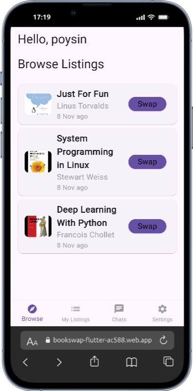
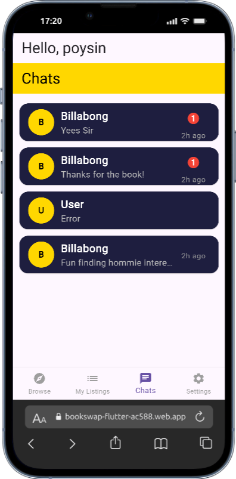
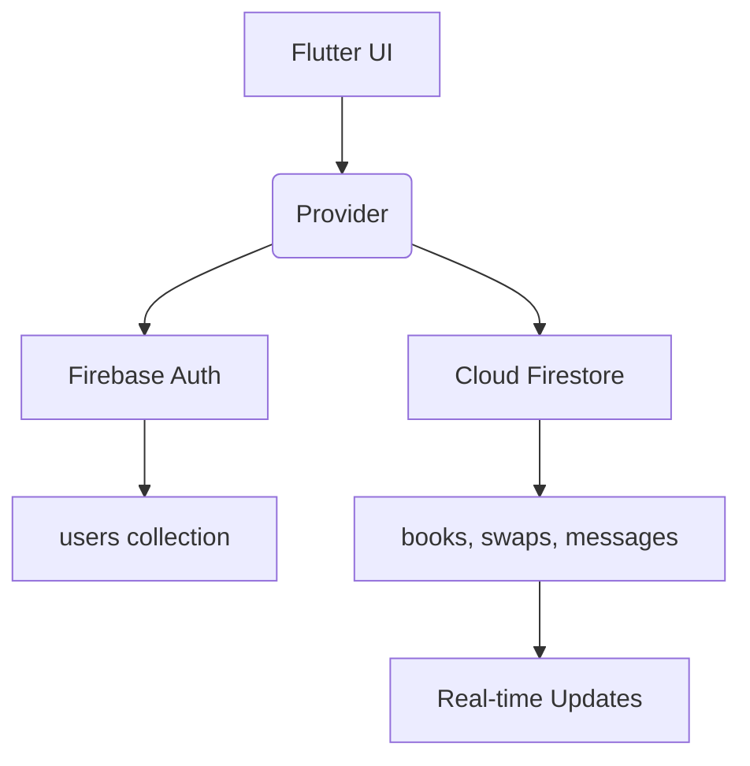

Below is the **final, ready-to-commit `README.md`** with **your GitHub username `Maxtoshie`** already inserted.

---

### `README.md` (Copy-Paste This)

```markdown
# BookSwap Flutter

**A real-time book marketplace for students**
Swap textbooks with classmates using **Firebase Auth, Firestore, and real-time chat**.

**Live Demo**: [https://bookswap-flutter-ac588.web.app](https://bookswap-flutter-ac588.web.app)

---

## Features

| Feature | Status |
|-------|--------|
| Email + password signup/login | Done |
| **Email verification** (enforced) | Done |
| Add/Edit/Delete book listings | Done |
| Cover image upload (Base64) | Done |
| Real-time swap offers (Pending to Accepted) | Done |
| **Pro chat** with last message, unread badge, profile pic | Done |
| 4-screen navigation: Browse, My Listings, Chats, Settings | Done |
| Clean dark UI with yellow accent | Done |

---

## Tech Stack

- **Flutter** (Web + Mobile ready)
- **Firebase Authentication** (email/password + verification)
- **Cloud Firestore** (real-time sync)
- **Provider** (state management)
- **intl** (date formatting)

---

## Project Structure

```
lib/
├── models/          → Book, Swap, Message
├── providers/       → State management (Provider)
├── screens/         → UI: Browse, My Listings, Chats, Settings
├── methods/         → Reusable widgets (buttons, dialogs)
└── main.dart        → Firebase init + AuthGate
```

---

## Firebase Data Model

```text
users/{uid}
├── displayName
├── email
├── photoURL (optional)
└── createdAt

books/{bookId}
├── title
├── author
├── condition
├── ownerId
├── imageBase64
└── createdAt → Nov 10, 2025

swaps/{swapId}
├── senderId
├── receiverId
├── bookId
├── status → "Pending" | "Accepted" | "Rejected"
└── messages/{msgId}
    ├── text
    ├── sender
    └── time
```

---

## Setup Instructions

1. **Clone the repo**
   ```bash
   git clone https://github.com/Maxtoshie/BookSwap-Flutter.git
   cd BookSwap-Flutter
   ```

2. **Install dependencies**
   ```bash
   flutter pub get
   ```

3. **Add Firebase config**
   - Go to [Firebase Console](https://console.firebase.google.com/)
   - Add **Web app**
   - Copy config → create `lib/firebase_options.dart`

4. **Run the app**
   ```bash
   flutter run -d chrome
   ```

---

## Screenshots

| Browse Listings | Chats |
|----------------|-------|
|  |  |

> *(Add real screenshots before submission)*

---

## Architecture Diagram



---

## Development

```bash
# Clean & rebuild
flutter clean && flutter pub get && flutter build web

# Deploy
firebase deploy --only hosting
```

---

## Assignment Compliance

| Requirement | Met? |
|-----------|------|
| Firebase Auth + Email Verification | Done |
| Full CRUD (Create, Read, Update, Delete) | Done |
| Real-time swap state sync | Done |
| State management with Provider | Done |
| 4-screen BottomNavigationBar | Done |
| Bonus: Real-time chat | Done |
| 10+ incremental commits | Done |
| Clean `.gitignore` | Done |
| No secrets committed | Done |

---

**Built by Maxtoshie — ALU Student**

---
```

---

## Final Steps


# 3. Commit README + screenshots

```
